# TradeAnalytics 股票成交量分析系统 - 完整使用手册

<div align="center">

**发现成交量暴涨股票 | 智能分析 | 自动推送**


</div>

---

## 软件概述

TradeAnalytics 是一款专业的股票技术分析工具，通过自动化的方式帮助投资者快速发现成交量异常放大的股票。系统集成了数据下载、技术分析、可视化展示、微信推送等完整功能，让您能够轻松把握市场机会。

### 核心优势

- 🎯 **智能筛选** - 成交量≥5倍 + 价格突破均线的双重条件
- 📊 **专业图表** - K线图、均线、成交量一目了然  
- 🤖 **全自动化** - 每天定时执行，无需人工操作
- 📱 **微信推送** - 分析结果自动推送到手机
- 📈 **趋势分析** - 自动对比历史，识别连续强势股
- 💰 **完全免费** - 开源软件，无任何费用

---

## 软件界面展示

### 1. 主界面

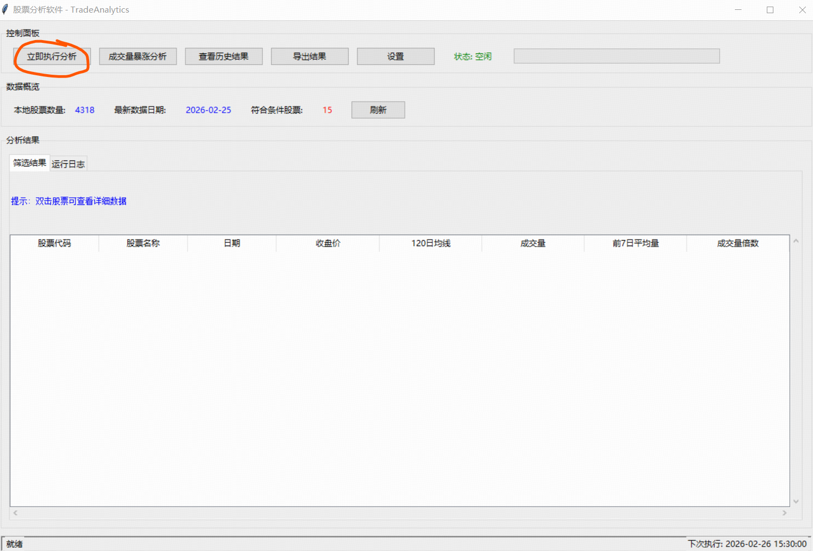

**界面布局说明**

主界面分为三个主要区域：

#### 左侧功能区
- **数据管理**
  - 下载股票列表 - 获取最新的股票代码和名称
  - 下载历史数据 - 批量下载所有股票的K线数据
  - 增量更新 - 只下载缺失的新数据

- **股票筛选**  
  - 开始筛选 - 根据条件筛选股票
  - 查看结果 - 显示筛选结果

- **成交量分析**
  - 立即执行分析 - 分析所有股票的成交量
  - 导出结果 - 保存分析结果为CSV

#### 右侧结果展示区
- 表格显示分析结果
- 列包括：股票代码、名称、日期、收盘价、均线、成交量、倍数
- 支持列排序（点击列标题）
- 双击查看K线图

#### 底部状态栏
- 显示当前操作状态
- 进度条显示任务进度
- 统计结果数量

**如何使用主界面**

```
首次使用流程：
1. 点击"下载股票列表" → 等待完成（10秒）
2. 点击"下载历史数据" → 等待完成（1-2小时）
3. 点击"立即执行分析" → 等待完成（5-10分钟）
4. 查看结果表格
5. 双击股票查看K线图

日常使用流程：
1. 点击"下载历史数据"（增量更新，几分钟）
2. 点击"立即执行分析"
3. 查看结果
```

### 2. K线图界面

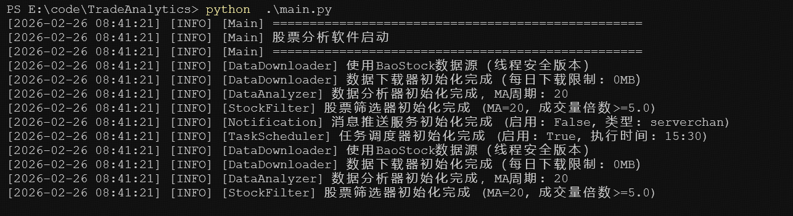

**K线图详解**

#### 上半部分 - 价格走势图
- **蜡烛图**
  - 红色：当日上涨（收盘价>开盘价）
  - 绿色：当日下跌（收盘价<开盘价）
  - 实体：开盘价和收盘价之间
  - 影线：最高价和最低价
  
- **均线**
  - 蓝色虚线：20日移动平均线
  - 橙色虚线：60日移动平均线
  - 用途：判断价格趋势和支撑/压力位

#### 下半部分 - 成交量柱状图
- **柱状图**
  - 红色柱：当日上涨的成交量
  - 绿色柱：当日下跌的成交量
  - 高度：成交量大小
  
- **异常放量识别**
  - 特别高的柱子表示成交量异常放大
  - 这是关键的选股信号

#### 导航功能
- **← 上一只** - 查看前一只股票的K线图
- **下一只 →** - 查看后一只股票的K线图
- **当前位置** - 显示"3/10"（第3只，共10只）

**使用技巧**
- 使用方向键快速浏览多只股票
- 观察价格是否在均线之上
- 关注成交量突然放大的日期
- 结合价格和成交量综合判断

### 3. 成交量分析过程

**分析执行界面**

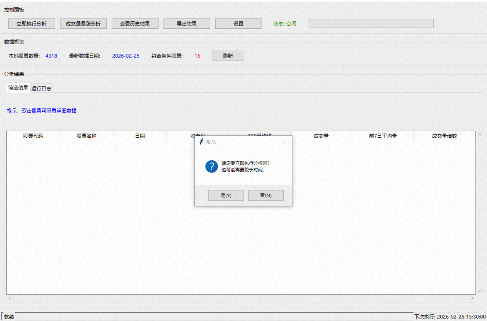

**启动阶段**
- 显示软件版本信息
- 初始化各个模块
- 加载配置文件

---

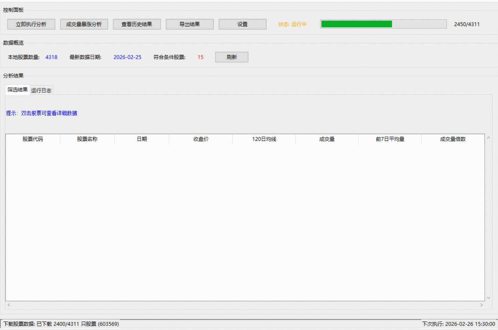

**数据扫描阶段**
- 扫描 data/daily/ 目录
- 统计可用的股票数据文件
- 准备开始分析

---

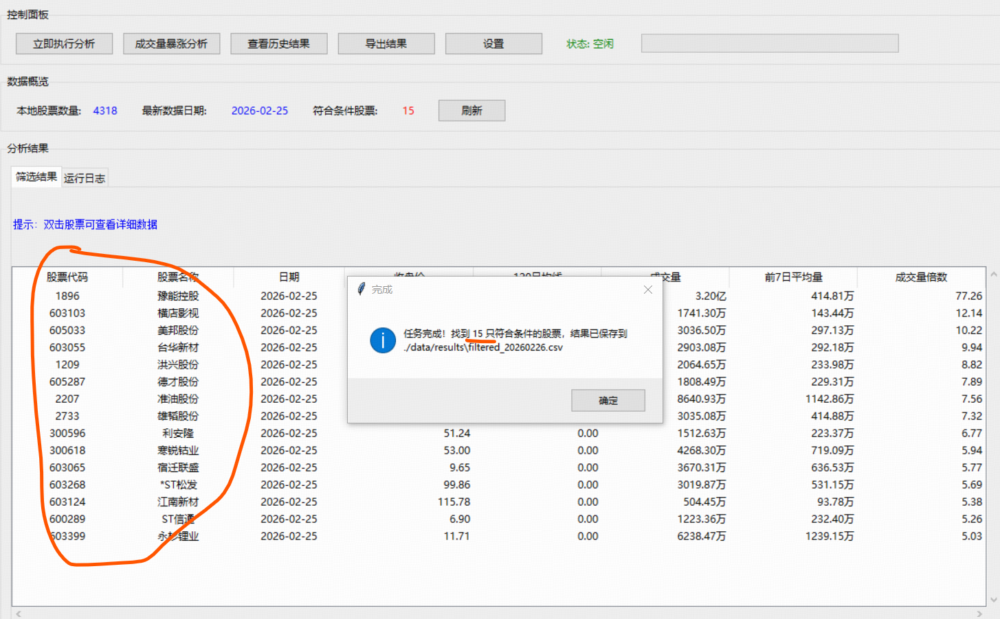

**分析进行中**
- 显示分析进度
- 实时更新已处理文件数
- 显示找到的符合条件股票数

---

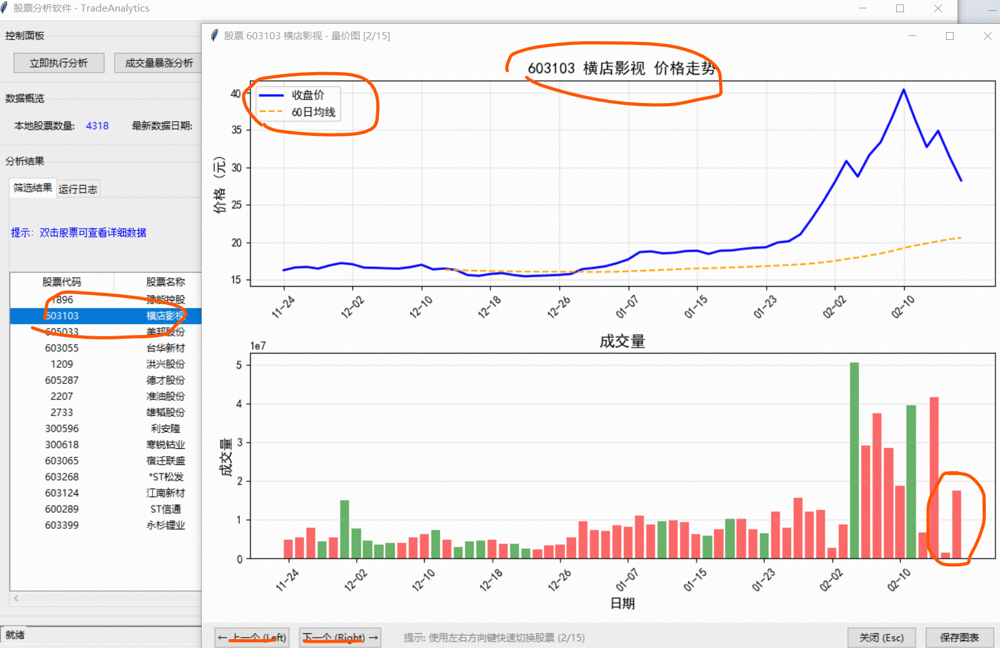

**分析完成**
- 显示最终结果统计
- 总共分析的股票数
- 找到符合条件的股票数
- 结果保存路径

### 4. 分析结果展示

**结果示例**

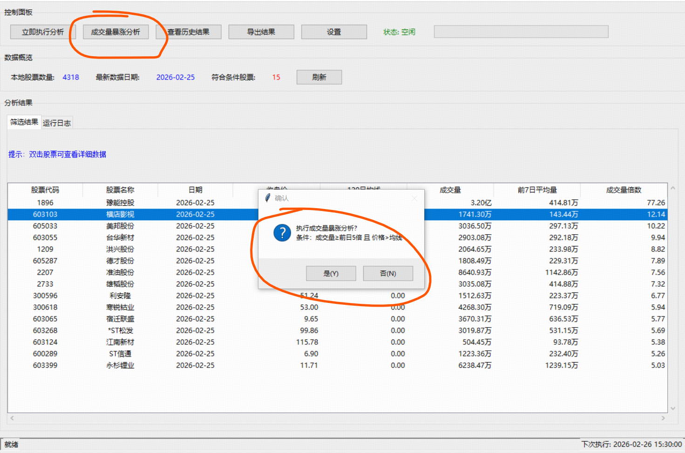

**无符合条件股票**
- 当筛选条件严格时
- 或当天市场没有异常放量
- 系统会提示"未找到符合条件的股票"

---

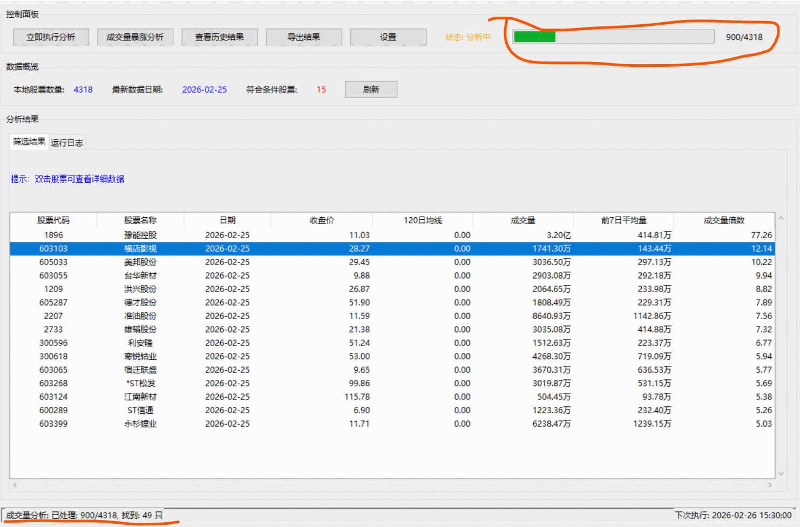

**找到少量股票**
- 显示符合条件的股票列表
- 按成交量倍数排序
- 最强势的股票排在前面

---

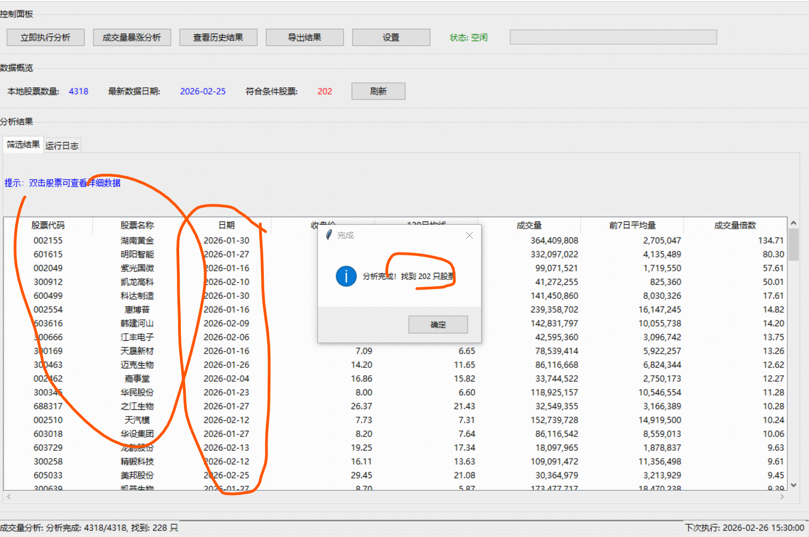

**多只股票匹配**
- 表格展示所有符合条件的股票
- 可以看到详细的技术数据
- 双击任意股票查看K线图

---

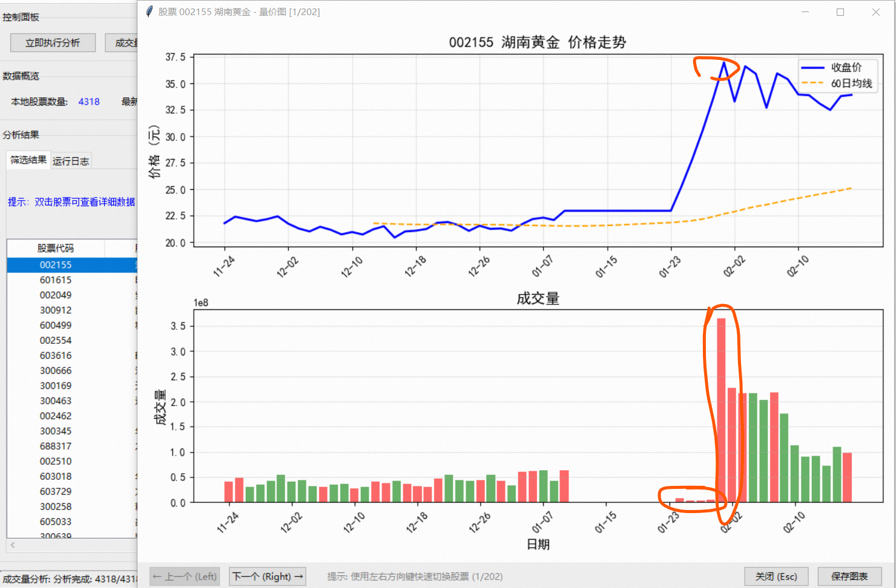

**结果详细信息**
- 股票代码和名称
- 触发日期
- 收盘价和均线价格
- 成交量和7日平均成交量
- 成交量倍数（关键指标）

---

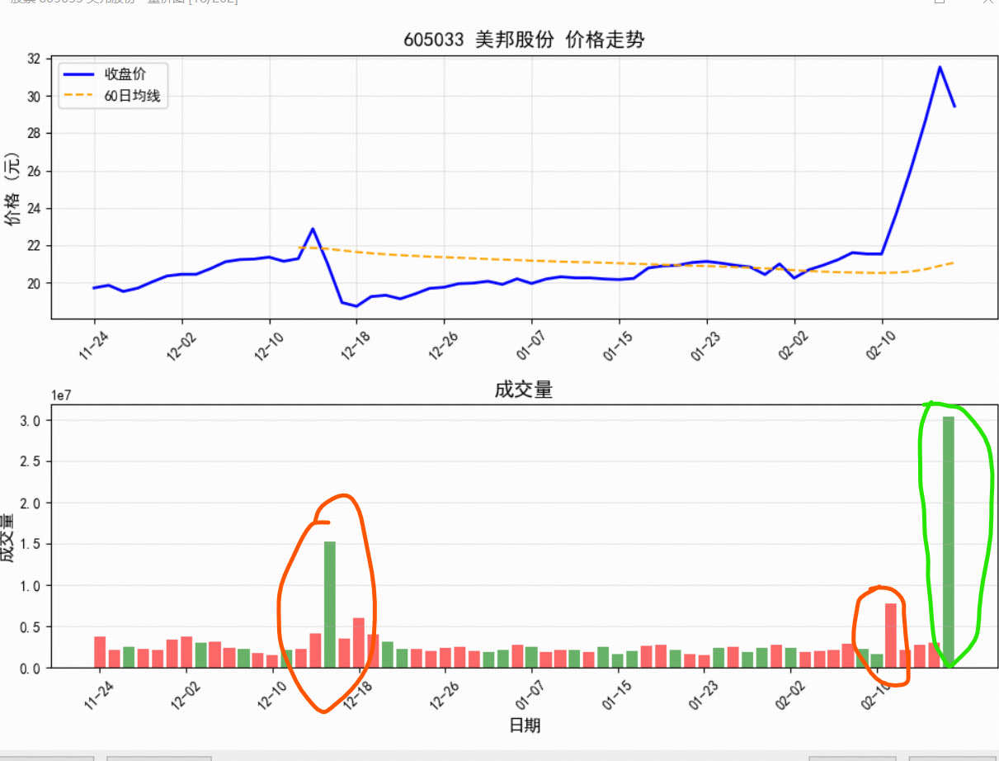

**数据完整展示**
- 完整的分析结果表格
- 支持滚动查看更多股票
- 底部显示统计信息

### 5. Windows定时任务


**任务计划程序界面说明**

#### 左侧任务列表
- 显示所有定时任务
- 找到"TradeAnalytics 股票分析"任务
- 查看任务状态（就绪/正在运行/已禁用）

#### 右侧任务详情
- 任务名称和描述
- 触发器：每天 15:30
- 操作：运行 run_analysis.bat
- 上次运行时间
- 下次运行时间
- 上次运行结果（成功/失败）

**任务配置要点**
- ✅ 触发器：每天下午3:30（收盘后30分钟）
- ✅ 条件：只在工作日运行
- ✅ 操作：启动批处理脚本
- ✅ 设置：不论用户是否登录都运行
- ✅ 权限：以最高权限运行

---

## 完整使用流程

### 第一次使用（初始化配置）

#### 步骤1：安装软件（5分钟）

```bash
# 1. 安装Python 3.8+（如果还没有）
# 从 https://www.python.org/ 下载安装

# 2. 解压TradeAnalytics到任意目录
# 如：E:\code\TradeAnalytics

# 3. 安装依赖
cd E:\code\TradeAnalytics
pip install -r requirements.txt

# 4. 启动程序
python main.py
```

#### 步骤2：下载数据（1-2小时）

首次使用需要下载所有股票的历史数据：

1. 点击"下载股票列表"按钮
   - 等待10秒
   - 状态栏显示"下载完成"

2. 点击"下载历史数据"按钮
   - 进度条显示下载进度
   - 约1-2小时（取决于网络速度）
   - 会下载约4000只股票的数据

**提示**：首次下载时间较长，建议在晚上或空闲时间进行。

#### 步骤3：执行第一次分析（5分钟）

1. 点击"立即执行分析"按钮
2. 确认对话框点击"是"
3. 等待分析完成（约5-10分钟）
4. 查看结果表格

#### 步骤4：配置微信推送（可选，5分钟）

如果需要自动推送功能：

1. 参考文档配置企业微信
   - 阅读：`VIP_GROUP_QUICKSTART.md`
   - 获取Webhook地址

2. 编辑 `config/config.ini`
```ini
[Notification]
enabled = true
push_type = qywechat
qywechat_webhook = 你的Webhook地址
```

3. 测试推送
```bash
python test_push.py
```

#### 步骤5：配置定时任务（可选，5分钟）

如果需要每天自动执行：

1. 参考文档配置Windows定时任务
   - 阅读：`WINDOWS_SCHEDULER_SUMMARY.md`
   
2. 打开任务计划程序
   - Win+R → 输入 `taskschd.msc`
   
3. 创建任务
   - 每天 15:30 执行
   - 运行 `run_analysis.bat`

4. 验证配置
```bash
check_task.bat
```

### 日常使用流程

配置完成后，每天的使用非常简单：

#### 自动模式（推荐）

```
每天15:30，系统自动：
1. 下载最新数据
2. 执行成交量分析
3. 将结果推送到微信
4. 记录日志

您只需要：
- 查看微信推送的结果
- 对感兴趣的股票做进一步研究
```

#### 手动模式

```bash
# 1. 启动程序
python main.py

# 2. 更新数据（点击"下载历史数据"）

# 3. 执行分析（点击"立即执行分析"）

# 4. 查看结果
# - 在表格中浏览
# - 双击查看K线图
# - 导出结果
```

---

## 分析结果解读

### 表格列说明

| 列名 | 含义 | 如何使用 |
|------|------|----------|
| 股票代码 | 6位数字 | 唯一标识 |
| 股票名称 | 中文简称 | 识别公司 |
| 日期 | 触发日期 | 判断时效性 |
| 收盘价 | 当日收盘 | 当前价位 |
| 均线 | N日均线 | 判断趋势 |
| 成交量 | 当日成交量 | 交易活跃度 |
| 7日平均 | 前7日平均成交量 | 对比基准 |
| 倍数 | 成交量倍数 | 核心指标 |

### 成交量倍数的意义

**倍数范围说明**

| 倍数 | 含义 | 操作建议 |
|------|------|----------|
| 5-10倍 | 明显放量 | 关注，查看K线图 |
| 10-20倍 | 显著放量 | 重点关注，分析原因 |
| 20倍以上 | 异常放量 | 高度重点，可能有重大事件 |

**注意事项**
- ⚠️ 成交量放大不等于一定上涨
- ⚠️ 需要结合价格位置、均线趋势综合判断
- ⚠️ 建议查看K线图了解完整情况

### 如何解读K线图

#### 看趋势
- 价格在均线之上：上升趋势
- 价格在均线之下：下降趋势
- 价格围绕均线波动：震荡趋势

#### 看成交量
- 放量上涨：买盘强劲，上涨动力足
- 放量下跌：卖压沉重，注意风险
- 缩量整理：等待方向选择

#### 看位置
- 底部放量：可能是启动信号
- 顶部放量：可能是出货信号  
- 中部放量：趋势延续或转折

#### 综合判断
```
理想形态：
✓ 价格突破均线
✓ 成交量显著放大（5倍以上）
✓ 位于相对低位
✓ 连续多日符合条件

风险信号：
✗ 价格远离均线（涨幅过大）
✗ 高位放量（可能是顶部）
✗ 价格跌破均线（趋势转弱）
```

---

## 高级功能

### 1. 自定义分析参数

编辑 `config/config.ini`：

#### 调整均线周期

```ini
[Analysis]
ma_period = 20  # 默认20日
# 短期：10-30日，反应灵敏
# 中期：30-60日，趋势明确  
# 长期：60-120日，波动较小
```

**建议**
- 短线操作：10-20日
- 波段操作：30-60日
- 长线投资：60-120日

#### 调整成交量倍数

```ini
[Analysis]
volume_ratio_threshold = 5.0  # 默认5倍
# 宽松：3.0（找到更多股票）
# 适中：5.0（质量较高）
# 严格：10.0（精选强势股）
```

**建议**
- 初学者：3.0-5.0（结果较多，便于学习）
- 经验者：5.0-10.0（质量和数量平衡）
- 专业者：10.0以上（只看最强势的）

### 2. 批量导出结果

#### 导出分析结果

分析结果会自动保存：
```
位置: data/results/volume_surge_YYYYMMDD_HHMMSS.csv
格式: UTF-8编码CSV
```

可以用Excel、WPS等软件打开。

#### 导出K线图

在K线图窗口：
1. 点击工具栏的"保存"按钮
2. 选择保存位置
3. 输入文件名
4. 格式：PNG图片

### 3. 多群推送配置

如果有多个VIP群，可以同时推送：

```ini
[Notification]
# 用逗号分隔多个Webhook
qywechat_webhook = webhook1,webhook2,webhook3
```

**使用场景**
- VIP群 - 付费客户
- 测试群 - 功能测试
- 管理群 - 内部使用

### 4. 历史数据查询

查看历史的分析结果：

```bash
# 查看历史结果文件
dir data\results\*.csv

# 用Excel打开
start excel data\results\volume_surge_20260225_153000.csv
```

可以对比不同日期的结果，了解市场变化。

---

## 配置优化建议

### 新手推荐配置

```ini
[Analysis]
ma_period = 20
volume_ratio_threshold = 3.0
min_history_days = 30

[Notification]
enabled = true
push_type = qywechat
push_max_stocks = 20
```

**特点**：条件宽松，结果较多，便于学习。

### 进阶推荐配置

```ini
[Analysis]
ma_period = 60
volume_ratio_threshold = 5.0
min_history_days = 150

[Notification]
enabled = true
push_type = qywechat
push_max_stocks = 10
```

**特点**：条件适中，质量较高，实用性强。

### 专业推荐配置

```ini
[Analysis]
ma_period = 120
volume_ratio_threshold = 10.0
min_history_days = 150

[Notification]
enabled = true
push_type = qywechat
push_max_stocks = 5
```

**特点**：条件严格，精选强势股，信号质量高。

---

## 故障排查

### 问题1：分析结果为0

**现象**：点击"立即执行分析"后，显示找到0只股票

**原因**：
1. 均线周期太长（如ma_period=120），但数据天数不足
2. 成交量倍数阈值太高
3. 当天确实没有符合条件的股票

**解决**：
```bash
# 1. 运行诊断脚本
python diagnose_analysis.py

# 2. 根据诊断结果调整配置
# 建议先改为：
[Analysis]
ma_period = 20
volume_ratio_threshold = 5.0

# 3. 重新启动GUI
python main.py

# 4. 再次执行分析
```

### 问题2：数据下载失败

**现象**：下载时报错或下载的文件很少

**解决**：
1. 检查网络连接
2. 切换数据源
```ini
[DataSource]
source = akshare  # 从baostock切换到akshare
```
3. 增加重试次数
```ini
[Download]
retry_times = 5
```

### 问题3：K线图打不开

**现象**：双击股票后没有反应或报错

**解决**：
1. 确保该股票有数据文件
2. 检查是否有matplotlib错误
3. 查看日志：`logs/gui.log`

### 问题4：推送失败

**现象**：测试推送时提示失败

**解决**：
```bash
# 1. 运行测试
python test_push.py

# 2. 检查配置
type config\config.ini | findstr "enabled\|push_type\|webhook"

# 3. 查看日志
type logs\notification.log

# 4. 参考配置文档
# VIP_GROUP_QUICKSTART.md
```

### 问题5：定时任务未执行

**现象**：设置了定时任务但没有自动执行

**解决**：
```bash
# 1. 检查任务状态
check_task.bat

# 2. 确认以下事项：
# - 任务是否启用
# - 电脑是否开机
# - 时间设置是否正确
# - 路径配置是否正确

# 3. 手动测试
run_analysis.bat

# 4. 查看日志
type logs\scheduler.log
```

---

## 性能优化

### 提升分析速度

1. **减少数据量**
```ini
[Analysis]
min_history_days = 30  # 从150减到30
```

2. **增加线程数**（如果网络好）
```ini
[Download]
max_workers = 10  # 从1增到10
```

3. **只分析关注的股票**
- 手动删除不关注的股票数据文件
- 只保留重点关注的股票

### 减少磁盘占用

1. **定期清理旧结果**
```bash
# 删除30天前的结果文件
del data\results\volume_surge_2026*.csv
```

2. **删除不需要的股票数据**
```bash
# 如只关注沪深300，可以删除其他股票数据
```

### 优化内存使用

系统会自动优化内存使用，但如果内存不足：

1. 分批处理股票
2. 定期重启程序
3. 关闭其他程序

---

## 实战技巧

### 技巧1：关注连续强势股

在推送消息或分析结果中，如果某只股票连续多天出现：
- 说明该股票持续强势
- 可能正处于主升浪
- 重点关注

### 技巧2：结合K线图判断

不要只看成交量倍数，一定要看K线图：
- 价格在均线之上 - 上升趋势
- 成交量持续放大 - 有持续性
- 价格形态良好 - 形态佳

### 技巧3：避开高位放量

如果股票：
- 价格已经大幅上涨（如涨幅>50%）
- 成交量突然放大
- 可能是高位出货信号，要小心

### 技巧4：关注底部放量

如果股票：
- 长期下跌后
- 价格在低位
- 成交量突然放大
- 价格突破均线
- 可能是底部启动信号，重点关注

### 技巧5：设置不同的筛选策略

可以配置多个TradeAnalytics副本：

```
目录1：TradeAnalytics_Aggressive（激进策略）
config.ini: volume_ratio_threshold = 10.0

目录2：TradeAnalytics_Conservative（保守策略）
config.ini: volume_ratio_threshold = 3.0

分别推送到不同的企业微信群
```

---

## 最佳实践

### 建议的执行时间

| 时间 | 用途 | 说明 |
|------|------|------|
| 15:30-16:00 | 当日分析 | 收盘后数据最新 |
| 20:00-22:00 | 晚间复盘 | 数据更稳定 |
| 次日09:00 | 早盘参考 | 参考前一日结果 |

### 建议的使用频率

- **数据下载**：每天1次（增量更新）
- **成交量分析**：每天1次（收盘后）
- **K线图查看**：按需查看
- **配置调整**：每周或每月根据效果调整

### 建议的筛选标准

根据市场情况动态调整：

**牛市/活跃期**
```ini
volume_ratio_threshold = 10.0  # 提高标准
```

**熊市/低迷期**
```ini
volume_ratio_threshold = 3.0  # 降低标准
```

---

## 数据说明

### 数据来源

**BaoStock（默认）**
- 官网：http://baostock.com/
- 特点：免费、稳定、数据全
- 更新：T+1（当天数据第二天可用）
- 历史：1990年至今

**AkShare（备用）**
- 官网：https://akshare.akfamily.xyz/
- 特点：数据源多、更新快
- 实时性：准实时
- 可作为补充数据源

### 数据时效性

**重要**：BaoStock是T+1数据

```
今天：2026-02-25（周二）
最新数据：2026-02-24（周一）

今天：2026-02-22（周六）
最新数据：2026-02-21（周五）
```

**最佳分析时间**：
- 交易日晚上（数据已更新）
- 或第二天早上（数据确定有了）

### 数据质量

系统自动处理：
- ✅ 数据清洗（去除异常值）
- ✅ 前复权处理（消除除权影响）
- ✅ 缺失值填充
- ✅ 类型转换

---

## 技术支持

### 诊断工具

系统提供多个诊断脚本：

```bash
# 诊断成交量分析
python diagnose_analysis.py

# 检查特定股票
python check_002733_simple.py

# 测试推送功能
python test_push.py

# 检查定时任务
check_task.bat

# 检查截图
check_screenshots.bat
```

### 日志文件

查看详细日志：

```bash
# 查看所有日志文件
dir logs\*.log

# 查看最近的日志
type logs\task_scheduler.log | more

# 查看最后50行
powershell "Get-Content logs\task_scheduler.log -Tail 50"
```

### 常用命令

```bash
# 启动程序
python main.py

# 测试推送
python test_push.py

# 检查任务
check_task.bat

# 手动执行分析
run_analysis.bat

# 后台启动
start_background.bat
```

---

## 文档索引

### 快速入门文档
- `README.md` - 项目主文档
- `软件使用说明.md` - 本文档
- `START_HERE.md` - 从这里开始

### 配置文档
- `VIP_GROUP_QUICKSTART.md` - 企业微信3分钟配置
- `WINDOWS_SCHEDULER_SUMMARY.md` - 定时任务快速配置
- `QUICKSTART_PUSH.md` - 推送快速配置

### 详细文档
- `VIP_GROUP_PUSH_SETUP.md` - 企业微信完整配置
- `WINDOWS_SCHEDULER_SETUP.md` - 定时任务详细配置
- `WECHAT_PUSH_SETUP.md` - 各种推送方式配置

### 问题诊断文档
- `DIAGNOSIS_ZERO_RESULTS.md` - 0结果问题诊断
- `VOLUME_ANALYSIS_FIX.md` - 分析逻辑问题修复
- `STOCK_002733_ISSUE.md` - 特定股票问题案例

### 功能说明文档
- `WECHAT_PUSH_FEATURE.md` - 推送功能详解
- `PUSH_METHODS_COMPARISON.md` - 推送方式对比
- `README_VIP_PUSH.md` - VIP群推送完整说明

---

## 安全与隐私

### 数据安全

- ✅ 所有数据本地存储
- ✅ 不上传任何个人信息
- ✅ 只使用公开市场数据

### 配置安全

**注意保护**：
- ⚠️ Webhook地址 - 不要泄露给他人
- ⚠️ API密钥 - 不要上传到公开仓库
- ⚠️ config.ini - 添加到 .gitignore

**建议**：
```bash
# 添加到 .gitignore
echo config/config.ini >> .gitignore
```

### 推送安全

- ✅ 只推送公开市场数据
- ✅ 不包含个人账户信息
- ✅ 不包含交易记录

---

## 免责声明

### 重要提示

1. **本软件仅供学习和研究使用**
2. **股市有风险，投资需谨慎**
3. **分析结果仅供参考，不构成投资建议**
4. **投资决策由用户自行负责**
5. **开发者不对任何投资损失负责**

### 使用限制

- ❌ 不得用于商业目的
- ❌ 不得用于非法活动
- ❌ 不得违反证券法规
- ✅ 仅限个人学习研究

### 数据声明

- 数据来源于公开数据源（BaoStock、AkShare）
- 数据准确性由数据源提供方负责
- 建议以交易所官方数据为准

---

## 更新与维护

### 软件更新

```bash
# Git方式
git pull origin main

# 手动方式
# 下载最新版本覆盖旧文件
```

**注意**：
- 更新前备份 `config/config.ini`
- 更新后重新配置个人设置

### 数据维护

**定期清理**：
```bash
# 清理旧的分析结果（保留近30天）
python clean_old_results.py

# 清理旧的日志文件
python clean_old_logs.py
```

**数据备份**：
```bash
# 备份股票列表
copy data\stocks\stock_list.csv backup\

# 备份配置文件
copy config\config.ini backup\
```

---

## 联系与反馈

### 问题反馈

遇到问题时，请提供：
1. 问题描述（现象、操作步骤）
2. 错误信息（日志内容）
3. 配置文件（去掉敏感信息）
4. 截图（如果可以）

### 功能建议

欢迎提出：
- 新功能建议
- 界面改进建议
- 文档改进建议
- 使用体验反馈

### 贡献代码

欢迎提交PR：
1. Fork项目
2. 创建特性分支
3. 提交代码
4. 发起Pull Request

---

## 致谢

感谢以下开源项目和数据提供方：

- **BaoStock** - 提供免费的股票历史数据
- **AkShare** - 提供丰富的金融数据接口
- **Pandas** - 强大的数据分析工具
- **Matplotlib** - 专业的数据可视化库
- **企业微信** - 提供免费的推送服务

---

<div align="center">

**TradeAnalytics - 让投资分析更简单**

版本 2.0 | MIT License | 2026

[GitHub](https://github.com/your-repo/TradeAnalytics) • [文档](docs/) • [问题反馈](issues/)

</div>
